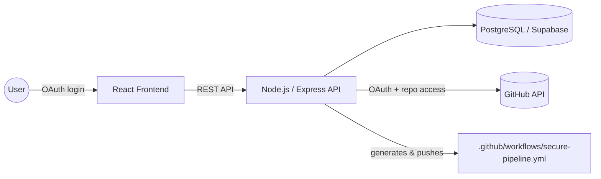

# 🔐 Auto Secure CI/CD Generator

> A production-ready SaaS platform that automatically generates secure, DevSecOps-ready CI/CD pipelines for your GitHub repositories — in minutes, not days.

[](#license)
[](#prerequisites)
[](#tech-stack)
[](#tech-stack)
[](#tech-stack)
[](#docker)

---

## 📑 Table of Contents

- [Overview](#-overview)
- [Features](#-features)
- [Tech Stack](#-tech-stack)
- [Architecture](#-architecture)
- [Prerequisites](#-prerequisites)
- [Getting Started](#-getting-started)
- [Usage Guide](#-usage-guide)
- [API Reference](#-api-reference)
- [Database Schema](#-database-schema)
- [Security](#-security)
- [Troubleshooting](#-troubleshooting)
- [Production Deployment](#-production-deployment)
- [Roadmap](#-roadmap)
- [Contributing](#-contributing)
- [License](#-license)

---

## 🧭 Overview

Setting up a secure CI/CD pipeline is tedious and easy to get wrong. **Auto Secure CI/CD Generator** connects to your GitHub account, detects your stack automatically, and generates a ready-to-use GitHub Actions workflow with **security scanning built in from day one** — no DevSecOps expertise required.

---

## ✨ Features

### Core Functionality
| Feature | Description |
|---|---|
| **GitHub OAuth Integration** | Connect your GitHub account securely in one click |
| **Smart Stack Detection** | Automatically detects Node.js, Python, Java, Go, Rust, or PHP projects |
| **Secure Pipeline Generation** | Generates GitHub Actions workflows with built-in security controls |
| **Pipeline Templates** | Choose between **Basic**, **Advanced**, or **Secure** (full DevSecOps) |

### Security Features
- 🛡️ **SAST** — Static Application Security Testing
- 🌐 **DAST** — Dynamic Application Security Testing
- 🔑 **Secrets Scanning** — detects exposed API keys and credentials
- 📦 **Dependency Scanning** — flags known-vulnerable packages
- 📊 **Security Dashboard** — real-time vulnerability tracking and scoring

### Additional Features
- 🔍 **CI/CD Analyzer** — paste an existing workflow and get fixes/suggestions
- 🚀 **One-click Push to GitHub** — commits the generated pipeline directly to your repo
- 🏆 **Security Scoring** — quantifies pipeline maturity at a glance
- ✅ **Best Practices** — built on industry-standard DevSecOps patterns

---

## 🛠️ Tech Stack

| Layer | Technologies |
|---|---|
| **Frontend** | React 18 · TypeScript · Tailwind CSS · Lucide React · Vite |
| **Backend** | Node.js · Express · clean architecture (controllers / services / utils) |
| **Database** | PostgreSQL via Supabase, with Row Level Security (RLS) and automatic migrations |
| **DevOps** | Docker & Docker Compose · Nginx · multi-stage builds |

---

## 🏗️ Architecture



**Backend structure**
```
backend/
├── src/
│   ├── server.js              # Express app setup
│   ├── config/
│   │   └── supabase.js        # Supabase client
│   ├── controllers/           # Request handlers
│   │   ├── auth.controller.js
│   │   ├── repo.controller.js
│   │   ├── pipeline.controller.js
│   │   └── analyzer.controller.js
│   ├── services/              # Business logic
│   │   ├── auth.service.js
│   │   ├── repo.service.js
│   │   ├── pipeline.service.js
│   │   └── analyzer.service.js
│   ├── routes/                # API routes
│   ├── middleware/
│   │   └── auth.middleware.js
│   └── utils/
│       ├── stack-detector.js
│       ├── yaml-generator.js
│       └── security-scanner.js
└── package.json
```

**Frontend structure**
```
src/
├── App.tsx                    # Main app component
├── main.tsx                   # Entry point
├── contexts/
│   └── AuthContext.tsx        # Auth state management
├── components/
│   ├── Header.tsx
│   ├── LoginPage.tsx
│   ├── Dashboard.tsx
│   ├── RepositoryCard.tsx
│   ├── PipelineGenerator.tsx
│   └── AnalyzerPage.tsx
└── lib/
    ├── supabase.ts
    └── api.ts
```

---

## ✅ Prerequisites

- **Node.js 18+** and npm
- **Docker** and Docker Compose *(optional, for containerized setup)*
- A **GitHub account**
- A **Supabase** account/project

---

## 🚀 Getting Started

### 1. Clone the repository

```bash
git clone <repository-url>
cd auto-secure-cicd-generator
```

### 2. Create a GitHub OAuth App

1. Go to [GitHub Developer Settings](https://github.com/settings/developers) → **New OAuth App**
2. Fill in the details:

   | Field | Value |
   |---|---|
   | Application name | `Auto Secure CI/CD Generator` |
   | Homepage URL | `http://localhost:5173` |
   | Authorization callback URL | `http://localhost:5173` |

3. Save your **Client ID** and **Client Secret** — you'll need them below.

### 3. Set up Supabase

Create a Supabase project and note your project URL and API keys — these populate the environment variables in the next step.

### 4. Configure environment variables

**Frontend (`.env`)**
```bash
cp .env.example .env
```
```env
VITE_API_URL=http://localhost:3001
VITE_GITHUB_CLIENT_ID=<your-github-client-id>
VITE_GITHUB_REDIRECT_URI=http://localhost:5173
VITE_SUPABASE_URL=<your-supabase-project-url>
VITE_SUPABASE_ANON_KEY=<your-supabase-anon-key>
```

**Backend (`backend/.env`)**
```bash
cd backend
cp .env.example .env
```
```env
PORT=3001
FRONTEND_URL=http://localhost:5173
DATABASE_URL=postgresql://postgres:<your-postgres-password>@localhost:5432/cicd_generator
GITHUB_CLIENT_ID=<your-github-client-id>
GITHUB_CLIENT_SECRET=<your-github-client-secret>
TOKEN_ENCRYPTION_KEY=<random-32-plus-character-secret>
```

> ⚠️ Never commit real `.env` files. Keep `TOKEN_ENCRYPTION_KEY` and `GITHUB_CLIENT_SECRET` out of version control.

### 5. Install dependencies

```bash
# Frontend
npm install

# Backend
cd backend && npm install
```

### 6. Run the app

**Option A — Development mode**

```bash
# Terminal 1 — Backend
cd backend
npm run dev

# Terminal 2 — Frontend
npm run dev
```

| Service | URL |
|---|---|
| Frontend | http://localhost:5173 |
| Backend API | http://localhost:3001 |

**Option B — Docker**

```bash
docker-compose up --build
```

| Service | URL |
|---|---|
| Frontend | http://localhost:80 |
| Backend API | http://localhost:3001 |

---

## 📖 Usage Guide

1. **Login with GitHub** — click "Continue with GitHub" and authorize the app.
2. **Sync repositories** — click "Sync Repositories" to load your repos into the dashboard.
3. **Generate a pipeline** — pick a repository, choose **Basic / Advanced / Secure**, and click "Generate Secure CI/CD Pipeline". Review the YAML and the security dashboard.
4. **Push to GitHub** — commit the pipeline directly to `.github/workflows/secure-pipeline.yml`.
5. **Analyze an existing pipeline** — go to "Fix My CI/CD", paste your YAML, and get warnings plus an optimized version.

---

## 🔌 API Reference

### Authentication
| Method | Endpoint | Description |
|---|---|---|
| `POST` | `/api/auth/github/callback` | Handle GitHub OAuth callback |
| `GET` | `/api/auth/me` | Get current authenticated user |
| `POST` | `/api/auth/logout` | Logout user |

### Repositories
| Method | Endpoint | Description |
|---|---|---|
| `GET` | `/api/repos` | List user repositories |
| `POST` | `/api/repos/sync` | Sync repositories from GitHub |
| `GET` | `/api/repos/:repoId` | Get repository details |
| `POST` | `/api/repos/:repoId/detect-stack` | Detect tech stack for a repo |

### Pipelines
| Method | Endpoint | Description |
|---|---|---|
| `POST` | `/api/pipelines/generate` | Generate a pipeline |
| `GET` | `/api/pipelines/repo/:repoId` | Get pipelines for a repository |
| `POST` | `/api/pipelines/:pipelineId/push` | Push pipeline to GitHub |
| `GET` | `/api/pipelines/:pipelineId/security` | Get the security dashboard |

### Analyzer
| Method | Endpoint | Description |
|---|---|---|
| `POST` | `/api/analyzer/analyze` | Analyze an existing YAML pipeline |

---

## 🗄️ Database Schema

| Table | Purpose |
|---|---|
| `users` | GitHub user information, encrypted access tokens |
| `repositories` | Repository metadata and detected tech stack (JSONB) |
| `pipelines` | Generated pipeline YAML, enabled security features, status |
| `security_scans` | Scan results: vulnerability counts and risk levels |

---

## 🔒 Security

- OAuth tokens are **encrypted at rest** in the database
- **Row Level Security (RLS)** ensures users only access their own data
- Input validation on all API endpoints
- Properly configured **CORS**
- All secrets managed via environment variables — **no hardcoded credentials**

### Generated pipelines include
- SAST, DAST, secrets scanning, and dependency scanning
- Automated testing and code coverage reporting
- Linting and code quality checks
- Docker containerization with multi-stage builds
- Deployment automation

---

## 🩺 Troubleshooting

<details>
<summary><strong>GitHub OAuth not working</strong></summary>

- Verify your GitHub OAuth app's callback URL matches **exactly** what's configured
- Double-check `GITHUB_CLIENT_ID` / `GITHUB_CLIENT_SECRET` in both `.env` files
- Confirm you're using the correct redirect URI
</details>

<details>
<summary><strong>Cannot connect to backend</strong></summary>

- Verify the backend is running on port `3001`
- Check the CORS configuration
- Ensure `VITE_API_URL` in the frontend `.env` is correct
</details>

<details>
<summary><strong>Database connection issues</strong></summary>

- Verify your Supabase URL and API keys
- Check that RLS policies are enabled
- Confirm migrations ran successfully
</details>

<details>
<summary><strong>Pipeline push fails</strong></summary>

- Verify the GitHub token has `repo` write permissions
- Confirm the repository exists and is accessible
- Check permissions on the `.github/workflows` directory
</details>

---

## 📦 Production Deployment

**Frontend**
1. Build the production bundle: `npm run build`
2. Deploy the `dist/` folder to your hosting provider
3. Configure environment variables on the host

**Backend**
1. Set `NODE_ENV=production`
2. Run under a process manager (PM2, systemd)
3. Set up a reverse proxy (Nginx, Caddy)
4. Enable HTTPS

**Docker**
```bash
docker-compose -f docker-compose.yml up -d
```

---

## 🗺️ Roadmap

- [ ] Multi-cloud support (AWS, Azure, GCP)
- [ ] GitLab and Bitbucket integration
- [ ] CLI tool for local pipeline generation
- [ ] AI-powered optimization suggestions
- [ ] Template marketplace
- [ ] Team collaboration features
- [ ] Advanced security reporting
- [ ] Integrations with SonarQube, Snyk, and other security tools

---

## 🤝 Contributing

Contributions are welcome!

1. Fork the repository
2. Create a feature branch: `git checkout -b feature/my-feature`
3. Commit your changes: `git commit -m "Add my feature"`
4. Push the branch: `git push origin feature/my-feature`
5. Open a Pull Request

Please open an issue first for major changes, so we can discuss what you'd like to do.

---

## 📄 License

This project is licensed under the **MIT License**. See the [`LICENSE`](./LICENSE) file for details.

## 💬 Support

For issues, questions, or suggestions, please open an issue on GitHub or contact the development team.

---

<p align="center">Built with ❤️ for DevSecOps engineers and developers who care about security.</p>
